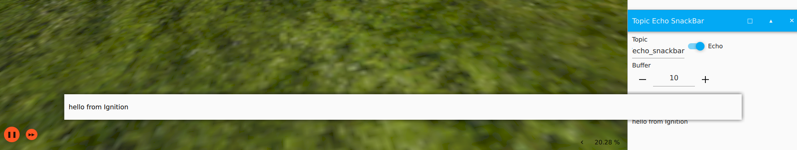

# Topic Echo SnackBar
A simple plugin based on `Topic Echo` plugin that publishes topics to the SnackBar for better visualization while simulation is running.
The implementation may not be the best, but it works.

# Use
To get it working simply add the plugin to your gui and then publish `Strings` on `/echo_snackbar` topic :

    ign topic -t /echo_snackbar -m ignition.msgs.StringMsg -p 'data: "hello from Ignition"'



## Customization
A part of the message can be bold, to do so you have to get the workd within `//` markers :
ign topic -t /echo_snackbar -m ignition.msgs.StringMsg -p 'data: "//hello_node// : from Ignition"'


The messages can also be displayed in color (only the plugin gui has RichText formatting, the SnackBar doesn't), example for error messages in red : 
ign topic -t /echo_snackbar -m ignition.msgs.StringMsg -p 'data: "<red>//BT_node// : Checks failed."'


The display time of the message is also a parameter, use this : `--duration:=1000` for a duration a 1000ms for example (default value=4000).
ign topic -t /echo_snackbar -m ignition.msgs.StringMsg -p 'data: "<green>//sensor_node// : bringup ok --duration:=1000"'


The following colors can be used in messages:

    - Basic Colors: <red>, <blue>, <green>, <yellow>, <black>, <white>, <gray>, <purple>, <cyan>, <magenta>
    - Web Colors: <darkred>, <darkblue>, <lightblue>, <lightgreen>, <orange>, <darkorange>, <pink>, <gold>, <silver>, <brown>, <indigo>, <violet>
    - Hex Codes: You can also use <#RRGGBB> format, e.g., <#ff5733> for a custom color.

## ROS2 example :

ROS_GZ_Bridge conf :

```xml
- topic_name: /echo_snackbar
  ros_type_name: std_msgs/msg/String
  gz_type_name: ignition.msgs.StringMsg
  direction: ROS_TO_GZ
```

ROS2 python node example extract:

    
    from std_msgs.msg import String

    self.publisher_info = self.create_publisher(String, '/echo_snackbar', 10)

    msg_to_publish = String()
    msg_to_publish.data = f"<green>//{self.get_name()}// : Localization coordinates found {self.get_target_coordinates} --duration:=1000"
    self.publisher_info.publish(msg_to_publish)

# Install

Successfully run on Ubuntu22 - ROS2 Humble - Gazebo Fortress

```bash
git clone https://github.com/Tanneguydv/topic_echo_snackbar.git
cd topic_echo_snackbar
source install.sh
``` 

on Dockerfile :

```Docker
# Clone the repository
RUN git clone https://github.com/Tanneguydv/topic_echo_snackbar.git
RUN cd topic_echo_snackbar && bash -c "source install.sh"
# Set the environment variable explicitly
ENV IGN_GUI_PLUGIN_PATH="/usr/local/lib/x86_64-linux-gnu/ign-gui-6/custom_plugins/:$IGN_GUI_PLUGIN_PATH"
```

For installation using other distros you will have to adapt [CMakeLists.txt](./CMakeLists.txt)
